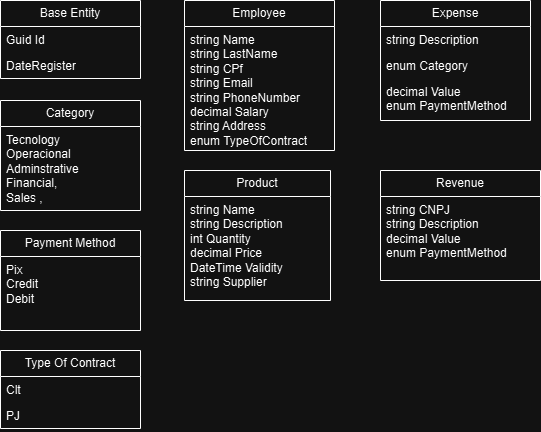
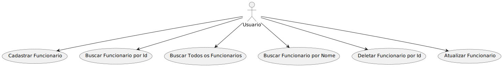
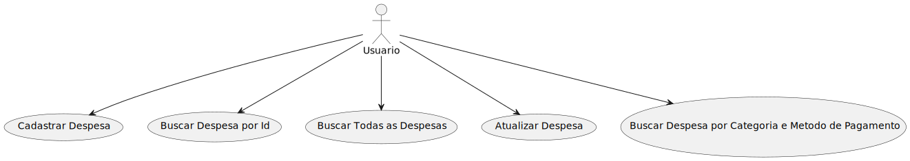
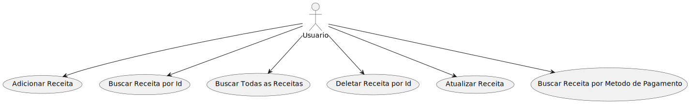

# TesteZDZ

Aplicação Web De Gerenciamento De uma Empresa

## Tabelas



## Casos de Uso




## Documentação da API

#### Cadastra Funcionário (Employee)

```http
  Post /api/Employee/createEmployee
```

| Parâmetro   | Tipo       | Descrição                           |
| :---------- | :--------- | :---------------------------------- |
| `name` | `string` | O nome do funcionário|
| `lastName` | `string` | O sobrenome do funcionário |
| `cPf` | `string` | O CPF do funcionário |
| `email` | `string` | O email do funcionário |
| `phoneNumber` | `number` | O Telefone do funcionário |
| `salary` | `number` | O salario do funcionário |
| `address` | `string` | O endereço do funcionário |
| `typeOfContract` | `enum` | O Tipo de Contrato  do O tipo de contrato (1: CLT, 2: PJ,  |


#### Retorna um Funcionario

```http
  GET /api/Employee/getById
```

| Parâmetro   | Tipo       | Descrição                                   |
| :---------- | :--------- | :------------------------------------------ |
| `id`      | `string` | **Obrigatório**. O ID do funcionario que você quer |

#### Retorna Todos os Funcionarios
```http
  GET /api/Employee/getAll
```

#### Retorna O Funcionario 
```http
  GET /api/Employee/getByName
```

| Parâmetro   | Tipo       | Descrição                                   |
| :---------- | :--------- | :------------------------------------------ |
| `name`      | `string` | **Obrigatório**. O nome do funcionario que você quer |


#### Deleta O Funcionario
```http
  Delete /api/Employee/deletebyId
```

| Parâmetro   | Tipo       | Descrição                                   |
| :---------- | :--------- | :------------------------------------------ |
| `id`      | `string` | **Obrigatório**. O id do funcionario que você quer deletar|

#### Atualiza O Funcionario
```http
  PUT /api/Employee/update
```

| Parâmetro   | Tipo       | Descrição                                   |
| :---------- | :--------- | :------------------------------------------ |
| `id`      | `string` | **Obrigatório**. O id do funcionario que você quer atualizar
 `name` | `string` | O nome do funcionário que você quer atualizar|
| `lastName` | `string` | O sobrenome do funcionário que você quer atualizar |
| `cPf` | `string` | O CPF do funcionário que você quer atualizar |
| `email` | `string` | O email do funcionário  que você quer atualizar|
| `phoneNumber` | `number` | O Telefone do funcionário que você quer atualizar|
| `salary` | `number` | O salario do funcionário que você quer atualizar |
| `address` | `string` | O endereço do funcionário que você quer atualizar |
| `typeOfContract` | `enum` | O Tipo de Contrato  do O tipo de contrato (1: CLT, 2: PJ) que você quer atualizar |

#### Cadastra Despesa (Expense)

```http
  Post /api/Expense/createExpense
```

| Parâmetro   | Tipo       | Descrição                           |
| :---------- | :--------- | :---------------------------------- |
| `description` | `string` | O descrição da despesa |
| `category` | `enum` | O categoria da despesa tecnology = 0,
|  |  | operacional = 1, administrative = 2,  financial = 3 e |
 | |  | sales = 4. |
| `value` | `decimal` | O valor  da despesa |
| `paymentMethod` | `enum` | O metodo de pagamente da despesa |


#### Retorna uma Despesa

```http
  GET /api/Expense/getById
```

| Parâmetro   | Tipo       | Descrição                                   |
| :---------- | :--------- | :------------------------------------------ |
| `id`      | `string` | **Obrigatório**. O ID da Despesa que você quer |

#### Retorna Todos as Despesas
```http
  GET /api/Expense/getAll
```

#### Deleta Uma Despesa
```http
  Delete /api/Expense/deletebyId
```

| Parâmetro   | Tipo       | Descrição                                   |
| :---------- | :--------- | :------------------------------------------ |
| `id`      | `string` | **Obrigatório**. A Despesa  que você quer deletar |


#### Atualiza A Despesa
```http
  Put /api/Expense/update    
```
| Parâmetro   | Tipo       | Descrição                                   |
| :---------- | :--------- | :------------------------------------------ |
| `id` | `string` | O descrição da despesa que voce quer atualizar |
| `description` | `string` | O descrição da despesa  que voce quer atualizar|
| `category` | `enum` | O categoria da despesa tecnology = 0,
|  |  | operacional = 1, administrative = 2,  financial = 3 e |
 | |  | sales = 4. |
| `value` | `decimal` | O valor  da despesa que voce quer atualizar|
| `paymentMethod` | `enum` |O metodo de pagamente da despesa que voce quer atualizar|


#### Busca a Categoria Quer voce Quer da Despesa
```http
  GET /api/Expense/byCategory
```
 Parâmetro   | Tipo       | Descrição                                   |
| :---------- | :--------- | :------------------------------------------ |
| `category` | `enum` | O categoria da despesa tecnology = 0,
|  |  | operacional = 1, administrative = 2,  financial = 3 e |
 | |  | sales = 4. |
|

#### Busca a Metodo de Pagamento Da Despesa 
```http
  GET /api/Expense/byPaymentMethod  
```
| Parâmetro   | Tipo       | Descrição                                   |
| :---------- | :--------- | :------------------------------------------ |
| `paymentMethod` | `enum` | O metodo de pagamente da despesa que voce quer buscar |
|


#### Cadastra O Produto

```http
  Post /api/Product/createProduct
```

| Parâmetro   | Tipo       | Descrição                           |
| :---------- | :--------- | :---------------------------------- |
| `name` | `string` | O nome da produto |
| `description` | `string` | O descrição do produto
| `quantity` | `int` | A Quantidade do Produto  |
| `price` | `decimal` | O preço do Produto
| `validity` | `date` | O data de validade do  produto
| `supplier` | `string` | O Nome do Fornecedor do Produto  |


#### Retorna Todos os Produtos
```http
  GET /api/Product/getAll
```

#### Deleta Uma Produto
```http
  Delete /api/Product/deletebyId
```
| Parâmetro   | Tipo       | Descrição                                   |
| :---------- | :--------- | :------------------------------------------ |
| `id`      | `string` | **Obrigatório**. A Produto que você quer deletar |

#### GET  Busca um  Produto
```http
  Delete /api/Product/getById
```

| Parâmetro   | Tipo       | Descrição                                   |
| :---------- | :--------- | :------------------------------------------ |
| `id`      | `string` | **Obrigatório**. O Produto que quer  buscar


#### Atualiza A Produto
```http
  Put /api/Product/update    
```
| Parâmetro   | Tipo       | Descrição                                   |
| :---------- | :--------- | :------------------------------------------ |
| `id` | `string` | O id do Produto do  que voce quer atualizar |
| `name` | `string` | O nome da produto que voce quer atualizar  |
| `description` | `string` | O descrição do produto  que voce quer atualizar 
| `quantity` | `int` | A Quantidade do Produto  que voce quer atualizar  |
| `price` | `decimal` | O preço do Produto que voce quer atualizar 
| `validity` | `date` | O data de validade do  produto que voce quer atualizar 
| `supplier` | `string` | O Nome do Fornecedor do Produto  que voce quer atualizar  |

#### Busca Por Nome do Fornecedor  
```http
  GET /api/Product/GetSearchBySupplier 
```
| Parâmetro   | Tipo       | Descrição                                   |
| :---------- | :--------- | :------------------------------------------ |
| `supplier` | `string` | O nome do fornecedor  que voce quer buscar |
|


#### Cadastra A Receita

```http
  Post /api/Revenue/createRevenue
```

| Parâmetro   | Tipo       | Descrição                           |
| :---------- | :--------- | :---------------------------------- |
| `cnpj` | `string` | O cnpj da Receita |
| `description` | `string` | O descrição da Receita
| `value` | `decimal` | O valor da receita   |
| `paymentMethod` | `enum` | O Metodo de Pagamento 


#### Retorna Todos os Receitas
```http
  GET /api/Revenue/getAll
```

#### Deleta Uma Receita
```http
  Delete /api/Revenue/deleteById
```
| Parâmetro   | Tipo       | Descrição                                   |
| :---------- | :--------- | :------------------------------------------ |
| `id`      | `string` | **Obrigatório**. A Receita que você quer deletar |

#### GET  Busca um  Receita
```http
  Delete /api/Revenue/getById
```

| Parâmetro   | Tipo       | Descrição                                   |
| :---------- | :--------- | :------------------------------------------ |
| `id`      | `string` | **Obrigatório**. O Receita que quer  buscar


#### Atualiza A Receita
```http
  Put /api/Revenue/update    
```
| Parâmetro   | Tipo       | Descrição                           |
| :---------- | :--------- | :---------------------------------- |
| `cnpj` | `string` | O cnpj da Receita que voce quer atualizar |
| `description` | `string` | O descrição da Receita que voce quer atualizar
| `value` | `decimal` | O valor da receita  que voce quer atualizar |
| `paymentMethod` | `enum` | O Metodo de Pagamento  que voce quer atualizar

#### Busca Por Metodo de Pagamento  
```http
  GET /api/Revenue/getPaymentMethod 
```
| Parâmetro   | Tipo       | Descrição                                   |
| :---------- | :--------- | :------------------------------------------ |
| `paymentMethod ` | `enum` | O metodo de pagamento   que voce quer buscar |


## Rodando localmente O Back-End e O Front-end Respectivamente

Clone o projeto

```bash
  git clone https://github.com/matheusandre1/TesteZDZ.git
```

Entre no diretório do projeto

```bash
  cd TesteZDZ.Api
```

Rode 

```bash
  dotnet run
```

Entre no diretório do projeto

```bash
  cd TesteZDZ.Front
```

```bash
  yarn build
  yarn dev
```


